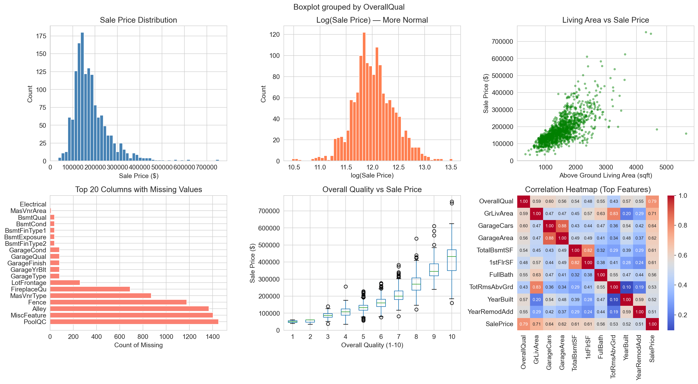
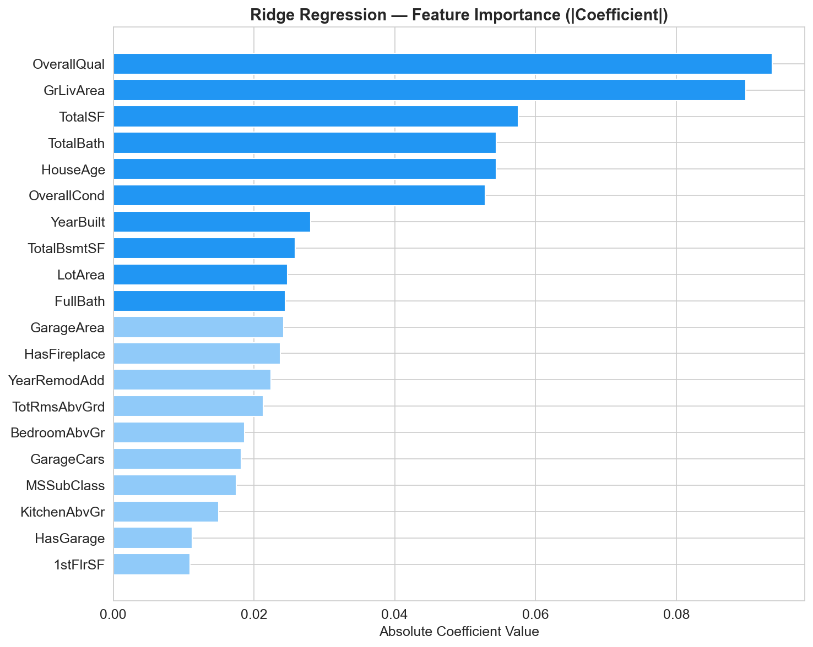
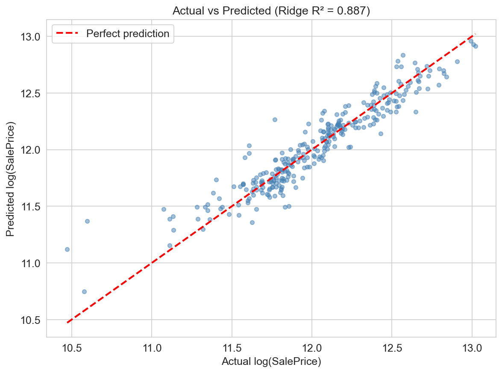

# House Price Predictor - Day 1: Machine Learning Core

A machine learning pipeline that performs Exploratory Data Analysis (EDA), feature engineering, and trains a Ridge Regression model to predict house prices using the Kaggle House Prices dataset. 

This repository contains the complete backend script that outputs evaluation metrics, visual plots, and serialized model files ready for deployment.

---

## 🛠️ Tech Stack

* **Language:** Python
* **Libraries:** Pandas, NumPy, Scikit-learn, Matplotlib, Seaborn, Pickle

---

## 📦 Installation & Setup

### Prerequisites
* Python 3.8+
* Git

## 📊 Visualizations

### Exploratory Data Analysis


### Feature Importance


### Actual vs. Predicted Prices


### Step-by-Step Guide

1. **Clone the repository:**
   ```bash
   git clone https://github.com/WatcherWatching/House-Prices.git
   cd House-Prices
